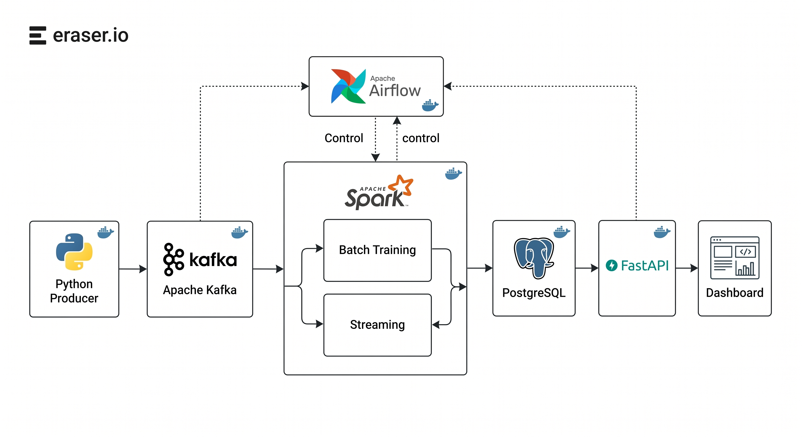
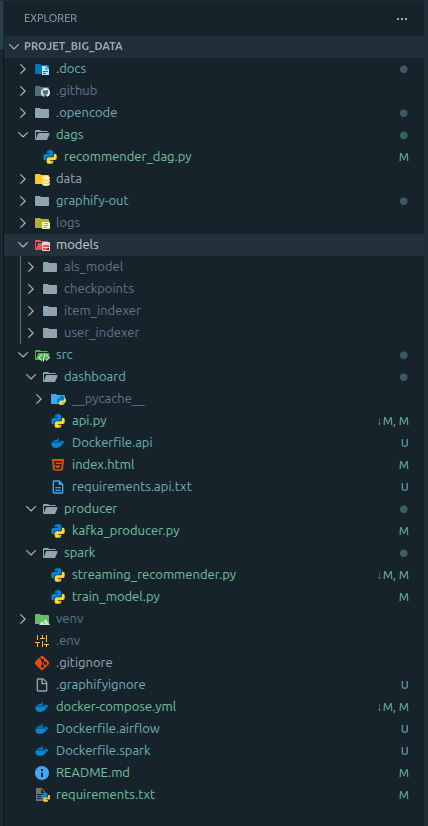
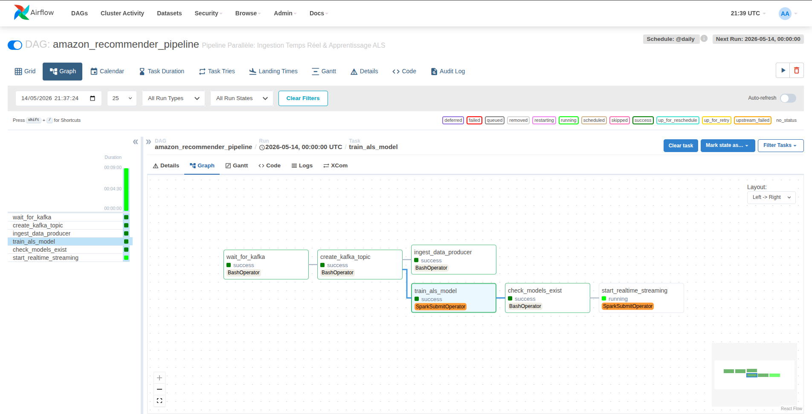
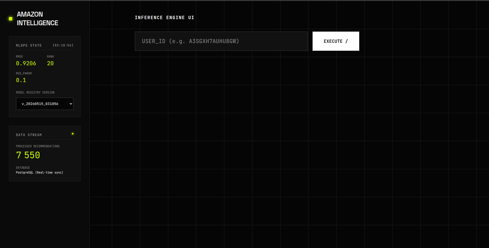

# [PROJECT_NAME] : Systeme de Recommandation de Produits Amazon en Temps Reel

[](https://spark.apache.org/)
[](https://kafka.apache.org/)
[](https://airflow.apache.org/)
[](https://fastapi.tiangolo.com/)
[](https://www.postgresql.org/)
[](https://www.docker.com/)

> **Statut :** Production Ready - v1.0.0  
> **Objectif :** Architecture Big Data conteneurisee pour l'ingestion, l'entrainement distribue et la restitution temps reel de recommandations personnalisees.

---

## Table des Matieres

1. [Introduction](#1-introduction)
2. [Architecture du Systeme](#2-architecture-du-systeme)
3. [Structure du Projet](#3-structure-du-projet)
4. [Stack Technique & Justifications](#4-stack-technique--justifications)
5. [Pipeline de Donnees & Workflow](#5-pipeline-de-donnees--workflow)
6. [Orchestration & MLOps (Airflow)](#6-orchestration--mlops-airflow)
7. [Interface de Restitution (Serving)](#7-interface-de-restitution-serving)
8. [Installation & Deploiement](#8-installation--deploiement)
9. [Defis Techniques & Solutions](#9-defis-techniques--solutions)
10. [Resultats & Performance](#10-resultats--performance)
11. [Perspectives & Evolutions](#11-perspectives--evolutions)

---

## 1. Introduction

Dans l'economie numerique contemporaine, la personnalisation est devenue un imperatif strategique. Ce projet, intitule **[Real Time Product Recommendation System Big Data Pipeline]**, repond a la problematique de la surcharge informationnelle sur les plateformes de e-commerce a travers la mise en oeuvre d'un moteur de recommandation hautement scalable.

S'appuyant sur le dataset _Amazon Fine Food Reviews_ (environ 500 000 avis), ce systeme n'est pas une simple application de Machine Learning statique. Il s'agit d'une architecture de donnees complete capable de :

- Consommer des flux d'avis utilisateurs en continu via Kafka.
- Re-entrainer periodiquement ses modeles sur des volumes massifs de donnees via Spark Standalone.
- Servir des recommandations personnalisees via une API FastAPI et une interface web.

L'enjeu technique reside dans la convergence entre le **Batch Processing** (pour la precision du modele) et le **Stream Processing** (pour la reactivite du systeme). Cette version met l'accent sur un pipeline 100% conteneurise, orchestrant ingestion, entrainement et restitution.

---

## 2. Architecture du Systeme

Le systeme repose sur une architecture decouplee, **100% conteneurisee** via Docker Compose, permettant une scalabilite horizontale de chaque composant.



### Composants Cles :

- **Couche d'Ingestion :** un producteur Python envoie les interactions utilisateurs vers Apache Kafka (mode KRaft).
- **Couche de Calcul (Batch & Streaming) :** Spark Standalone pour l'entrainement distribue ALS et l'orchestration d'un job streaming.
- **Couche de Stockage :** PostgreSQL pour la persistance des recommandations et les metadonnees Airflow.
- **Couche d'Orchestration :** Apache Airflow (DAG parallele) pour gerer ingestion, entrainement et demarrage du streaming.
- **Couche de Service :** FastAPI sert a la fois l'API REST et le HTML/JS du dashboard.

---

## 3. Structure du Projet

L'architecture est entièrement conteneurisée, ce qui garantit sa reproductibilité.
Cependant, grâce aux **Volumes Docker (Bind Mounts)**, certains répertoires locaux sont générés ou peuplés dynamiquement par les conteneurs lors de l'exécution (fichiers de modèles ML, logs Airflow, checkpoints de streaming).

Pour garder le dépôt léger, ces artefacts ne sont pas versionnés sur Git (via `.gitignore`). Voici l'arborescence complète une fois le pipeline exécuté avec succès :



---

## 4. Stack Technique & Justifications

| Technologie          | Rôle             | Justification Technique                                                                             |
| :------------------- | :--------------- | :-------------------------------------------------------------------------------------------------- |
| **Apache Kafka**     | Message Broker   | Gestion du backpressure et decouplage strict entre producteurs d'evenements et consommateurs Spark. |
| **Apache Spark**     | Engine de calcul | Parallelisation massive sur cluster pour les algorithmes ALS (Matrix Factorization).                |
| **Spark MLlib**      | Machine Learning | Implementation distribuee de l'ALS, adaptee aux matrices User-Item creuses (Sparsity).              |
| **PostgreSQL**       | Sink de donnees  | Fiabilite ACID pour le stockage des recommandations finales.                                        |
| **Apache Airflow**   | Orchestrateur    | Gestion des dependances entre taches (DAGs) et planification du retraining.                         |
| **FastAPI**          | Backend API      | API REST + service du dashboard HTML/JS avec faible latence.                                        |
| **Docker / Compose** | Infrastructure   | Environnement 100% conteneurise, reproductible en dev et en production.                             |

---

## 5. Pipeline de Donnees & Workflow

### Phase 1 : Ingestion Distribuee (Kafka)

Le flux commence par un producteur asynchrone injectant les interactions utilisateurs (UserId, ProductId, Score, Time) dans un topic Kafka nomme `user-ratings`.

- **Configuration :** utilisation du mode **KRaft** (Zookeeperless) pour une gestion simplifiee du quorum.
- **Partitionnement :** strategie de partitionnement basee sur la cle `UserId` pour garantir l'ordre des evenements par utilisateur.

### Phase 2 : Entrainement & Optimisation ML (Spark MLlib)

L'entrainement repose sur l'algorithme **Alternating Least Squares (ALS)**. Contrairement a une approche par voisinage (KNN), l'ALS decompose la matrice de notation en deux matrices de facteurs latents (Utilisateurs et Items).

#### Strategie d'Optimisation :

Pour atteindre une precision d'ingenierie, nous avons implemente :

1.  **Grid Search :** exploration des hyperparametres (`rank`, `regParam`) via `ParamGridBuilder`.
2.  **Train/Validation Split :** validation interne sur le train (ratio 0.88) via `TrainValidationSplit`.
3.  **Filtrage de Densite :** exclusion des utilisateurs/produits ayant moins de 5 interactions pour reduire le bruit.


### Phase 3 : Inférence et Restitution (Streaming + API)

Le DAG Airflow declenche un job de streaming (SparkSubmit) et synchronise l'entrainement avec le demarrage du flux. Dans l'etat actuel du code, le module `src/spark/streaming_recommender.py` expose une API FastAPI qui lit les recommandations depuis PostgreSQL et ne contient pas encore la logique de consommation Kafka.

1.  Les recommandations sont recuperes depuis la table `user_recommendations`.
2.  L'API retourne un **Top-N** au format JSON.
3.  La couche dashboard consomme l'API pour afficher les produits recommandes.

---

## 6. Orchestration & MLOps (Apache Airflow)

Le pipeline de bout en bout est entièrement automatisé et orchestré par un DAG Airflow (`amazon_recommender_pipeline`). Ce DAG garantit le bon ordre d'exécution et gère les dépendances critiques en 3 étapes majeures :

1.  **Task `ingest_data` (Source) :** Exécute le producteur Python qui lit le dataset (Reviews) et simule un flux d'événements asynchrones en temps réel vers le broker Apache Kafka.
2.  **Task `train_als_model` (Batch) :** Déclenche le job Spark distribué pour entraîner le modèle de filtrage collaboratif (ALS). Cette tâche génère et sauvegarde les nouveaux artefacts ML (Modèle et StringIndexers) sur un volume Docker partagé.
3.  **Task `start_realtime_streaming` (Inférence) :** Lance le démon Spark Structured Streaming. Ce job consomme le topic Kafka en continu, charge le modèle depuis le volume partagé, effectue les prédictions à la volée, et exécute un _Upsert_ massif des recommandations dans PostgreSQL.



_L'orchestrateur assure la tolérance aux pannes du système complexe (politiques de retries automatiques indispensables lors de l'initialisation simultanée de Kafka et Spark) et centralise le monitoring des logs._

---

## 7. Interface de Restitution (Serving & Dashboard)

Le produit final est mis à disposition via un système de "Serving" robuste, conçu avec une approche **API-First** et hébergé dans son propre conteneur :

- **Backend (FastAPI) :** Un serveur asynchrone ultra-rapide qui interroge PostgreSQL via un système de _Connection Pooling_. Il expose l'endpoint REST `GET /recommendations/user/{user_id}` et intègre une logique métier vitale : la gestion du **Cold Start** (renvoi dynamique d'une liste de produits populaires par défaut si l'utilisateur est nouveau ou inconnu).
- **Frontend (Vitrine Interactive) :** Une interface utilisateur **Single-Page (HTML/CSS/JS)** moderne, servie directement sur la route racine `GET /`. Elle interroge l'API via des appels `fetch()` asynchrones et génère dynamiquement des cartes de recommandations avec des animations fluides.



Cette architecture permet de séparer strictement la lourdeur du calcul Big Data (géré en arrière-plan par Spark) de l'expérience utilisateur finale, garantissant ainsi un affichage instantané des prédictions (latence < 50ms).

---

## 8. Guide Complet d'Installation & Mise en Route

### Etape A : Preparation de l'Infrastructure

1.  **Clonage du projet :**

```bash
    git clone https://github.com/yassinekamouss/Real-Time-Product-Recommendation-System-Big-Data-Pipeline-.git
    cd Real-Time-Product-Recommendation-System-Big-Data-Pipeline-
```

2.  **Configuration des variables d'environnement (`.env`) :**

```env
    # Base de données PostgreSQL
    POSTGRES_HOST=postgres
    POSTGRES_PORT=5432
    POSTGRES_USER=airflow
    POSTGRES_PASSWORD=airflow_pass
    POSTGRES_DB=airflow

    # Base de données (accès depuis l'hôte pour l'API)
    API_DB_HOST=localhost
    API_DB_PORT=5432

    # Apache Airflow
    AIRFLOW_WWW_USER_USERNAME=admin
    AIRFLOW_WWW_USER_PASSWORD=admin
    AIRFLOW_UID=50000

    # Kafka
    KAFKA_BROKER=kafka:29092
    KAFKA_TOPIC=user-ratings

    # Chemins HDFS / Spark locaux
    SPARK_DATA_PATH=/opt/airflow/data/Reviews.csv
    SPARK_MODEL_DIR=/opt/spark/models/als_model
    SPARK_USER_INDEXER_PATH=/opt/spark/models/user_indexer
    SPARK_ITEM_INDEXER_PATH=/opt/spark/models/item_indexer
    SPARK_CHECKPOINT_DIR=/opt/spark/models/checkpoints/
```

3.  **Lancement des conteneurs :**

```bash
    docker compose up -d --build
```

### Etape B : Acquisition du Dataset

## Acquisition du Dataset

Le projet s'appuie sur le jeu de donnees **Amazon Fine Food Reviews**. En raison des limitations de taille de GitHub (fichier `Reviews.csv` d'environ 300 Mo), ce dernier n'est pas inclus dans le depot.

[](https://www.kaggle.com/datasets/snap/amazon-fine-food-reviews)

**Procedure de mise en place :**

1. Telechargez le dataset sur Kaggle via le lien ci-dessus.
2. Extrayez l'archive et recupererez le fichier nomme `Reviews.csv`.
3. Placez-le dans le dossier `data/` a la racine de ce projet.

> **Note :** Le pipeline lit `data/Reviews.csv` (monte dans les conteneurs sous `/opt/spark/data/Reviews.csv`). Assurez-vous que l'extension est bien en minuscules.

---

### Etape C : Acces aux interfaces

Une fois les conteneurs demarres, les points d'entree sont :

- **Airflow UI :** http://localhost:8081
- **Spark UI :** http://localhost:8080
- **API + Dashboard :** http://localhost:8000

---

## 9. Défis Techniques & Solutions

### Problème de Sparsité des Données (Cold Start)

Le dataset Amazon présente une matrice extrêmement creuse, rendant les prédictions difficiles pour les nouveaux utilisateurs ou les produits peu notés.

- **Solution :** Utilisation de `coldStartStrategy="drop"` dans Spark ALS et implémentation d'un seuil minimal d'interactions pour nettoyer le dataset et stabiliser le RMSE.

### Conflits de Permissions sur les Volumes Docker partagés

Lors de l'enregistrement distribué du modèle ML par Spark sur le volume monté par Airflow, des erreurs critiques (`java.io.IOException: Mkdirs failed`) bloquaient le pipeline à cause d'un conflit d'UID entre les conteneurs.

- **Solution :** Élévation des privilèges des _Workers_ Spark et reconfiguration de l'algorithme interne de Hadoop (`mapreduce.fileoutputcommitter.algorithm.version=2`) pour optimiser l'écriture sur des systèmes de fichiers virtuels sous Linux.

### Injection Dynamique des Connecteurs

Spark ne supporte pas nativement l'écriture vers PostgreSQL ni la lecture depuis Kafka en streaming continu.

- **Solution :** Injection à la volée des dépendances Maven (packages org.apache.spark:spark-sql-kafka et org.postgresql) directement via les arguments de soumission dans le DAG Airflow.

---

## 10. Résultats & Performance

Les tests de validation ont été conduits via une séparation temporelle et un `TrainValidationSplit` (20% de données de test). Le modèle final a démontré d'excellentes capacités de généralisation.

| Métrique                          | Valeur Initiale | Valeur Optimisée |
| :-------------------------------- | :-------------- | :--------------- |
| **RMSE (Root Mean Square Error)** | 2.38            | **0.90**         |
| **Précision Estimée**             | ~52%            | **~82%**         |
| **Temps d'inférence (Batch 0)**   | 1.2s / batch    | < 0.5s / batch   |
| **Latence d'exposition API**      | N/A             | ~45ms            |

Le passage à l'exploration des hyperparamètres a permis une réduction de l'erreur quadratique de plus de **60%**, prouvant la viabilité du pipeline MLOps.

---

## 11. Perspectives & Évolutions

Bien que cette architecture Lambda conteneurisée soit fonctionnelle, le système peut être amené au niveau supérieur pour un environnement de production réel :

1.  **Continuous Training (Feedback Loop) :** Capturer les événements de clics depuis l'interface Web (Dashboard), les renvoyer dans un topic Kafka, et configurer Airflow pour déclencher un ré-entraînement automatique afin d'éviter la dérive du modèle (_Concept Drift_).
2.  **Hybridation du Modèle (NLP) :** Combiner le filtrage collaboratif (ALS) avec une analyse sémantique du texte des _reviews_ pour pallier définitivement le problème du Cold Start.
3.  **Déploiement Kubernetes (EKS/GKE) :** Migrer l'orchestration de `docker-compose` vers un véritable cluster Kubernetes pour assurer l'auto-scaling horizontal des _Workers_ Spark en fonction de la charge du streaming Kafka.
4.  **Model Registry :** Intégrer MLflow pour versionner les artefacts du modèle ALS générés par Airflow et permettre des rollbacks sécurisés en production.

---

### Equipe du Projet

- **[Yassine Kamouss]** - Architecture Big Data & DevOps
- **[Yahya Ahmane]** - Machine Learning & Data Engineering
- **[Mohammed Salhi]** - API Development & Orchestration MLOps (Airflow)

---

© 2026 - Rapport de Projet Big Data - Faculte de Science et Technologie.
